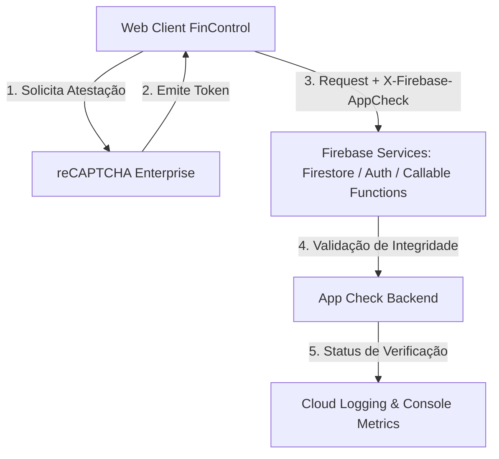

# FinControl — Firebase App Check: Guia de Arquitetura, Observabilidade e Rollout Seguro

Este documento detalha o plano de preparação, observabilidade, readiness de enforcement e rollback do Firebase App Check no FinControl.

---

## 1. Visão Geral e Arquitetura

O Firebase App Check fornece uma camada adicional de atestação de integridade de cliente, ajudando a proteger os serviços de backend contra abuso, requisições forjadas e tráfego de bots não autorizados.

> [!IMPORTANT]
> **Fronteira de Responsabilidades:**
> - **Firebase Authentication:** Identifica **quem** é o usuário (identidade, credenciais, ownership de dados).
> - **Firestore Security Rules:** Autoriza **o que** o usuário autenticado pode ler/escrever.
> - **Firebase App Check:** Atesta **de onde** a requisição se originou (se partiu do app Web FinControl legítimo).
> - **App Check NÃO substitui Rules, Auth, Rate Limiting, HMAC ou Idempotência.**



---

## 2. Provedor Web Canônico

O FinControl utiliza o **reCAPTCHA Enterprise Provider** (`ReCaptchaEnterpriseProvider` do pacote `firebase/app-check` do Firebase JS SDK).

- **Identificador Público:** A site key do reCAPTCHA Enterprise é configurada via variável pública `VITE_FIREBASE_APPCHECK_SITE_KEY`.
- **Auto-Refresh:** O parâmetro `isTokenAutoRefreshEnabled: true` é mantido ativo para renovação transparente em background de tokens de atestação antes da expiração.
- **Ordem de Inicialização:** O App Check é inicializado imediatamente após `initializeApp(firebaseConfig)` e **antes** de instanciar os serviços `getFirestore(app)` e `getAuth(app)` em `src/utils/firebase.js`.

---

## 3. Inventário da Superfície e Classificação de Serviços

| Serviço / Endpoint | Tipo de Acesso | App Check Suportado | Estado Atual | Enforcement Alvo | Mecanismo de Defesa Principal |
| :--- | :--- | :--- | :--- | :--- | :--- |
| **Firestore** | Web SDK (Browser) | SIM | **OFF** | Decidir pós-monitoramento | Firestore Rules + Partitioning |
| **Firebase Auth** | Web SDK (Browser) | SIM (Identity Platform) | **OFF** | Decidir pós-monitoramento | Identity Verification + UID ownership |
| **createMercadoPagoPreference** | Callable Function (`onCall`) | SIM (`request.app`) | **OFF** | Decidir pós-monitoramento | Rate Limit + Auth + Schema Validation |
| **deleteUserAccount** | Callable Function (`onCall`) | SIM (`request.app`) | **OFF** | Decidir pós-monitoramento | Auth + CAS Lock + emailVerified |
| **reportClientError** | Callable Function (`onCall`) | SIM (`request.app`) | **OFF** | Decidir pós-monitoramento | Rate Limit IP/UID + Whitelist Sanitizer |
| **paymentWebhookMercadoPago** | HTTP Function (`onRequest`) | **NÃO** | **N/A (Excluído)** | **N/A (Sem App Check)** | HMAC-SHA256 (`x-signature`) + Idempotency |
| **generateAiMonthlyBriefing** | Callable Function (`onCall`) | SIM (`request.app`) | **NÃO DEPLOYADA** | Futuro (pós-gate IA) | AI Rate Limit + Token Caps |

---

## 4. Exclusão do Webhook do Mercado Pago

O endpoint `paymentWebhookMercadoPago` é invocado diretamente pelos servidores do Mercado Pago (*server-to-server HTTP POST*) e **não** através do Firebase Web SDK.
- **Regra Rígida:** App Check **NUNCA** deve ser exigido neste endpoint.
- O webhook continuará sendo auditado e protegido exclusivamente por sua assinatura criptográfica `x-signature` (HMAC-SHA256 com `timingSafeEqual`), validação de `data.id`, rastreamento de idempotência em Firestore e caps de concorrência.
- O tráfego do webhook é estritamente excluído do denominador de métricas de App Check do cliente Web.

---

## 5. Ambientes de Desenvolvimento e CI (Zero Secrets no Frontend)

### 5.1. Desenvolvimento Local (Localhost)
1. Para desenvolvimento local, usa-se a flag booleana não secreta `VITE_FIREBASE_APPCHECK_DEBUG=true` (ou inicialização em DEV).
2. O código define `self.FIREBASE_APPCHECK_DEBUG_TOKEN = true` em tempo de execução.
3. O Firebase JS SDK gera um token de debug no console do navegador:
   ```
   App Check debug token: XXXXXXXX-XXXX-XXXX-XXXX-XXXXXXXXXXXX. You will need to add it to your Firebase console.
   ```
4. O desenvolvedor copia esse token e o cadastra no Firebase Console (*App Check → Apps → Manage debug tokens*).
5. **Nenhum valor de token de debug é embutido no código-fonte ou no `.env`.**

### 5.2. Integração Contínua (CI / Playwright)
- Em pipelines de teste automatizado, caso seja necessária atestação em emuladores ou ambiente de staging, o token de debug é armazenado exclusivamente no **GitHub Actions Secrets** (ex: `APP_CHECK_DEBUG_TOKEN_FROM_CI`).
- A injeção ocorre em tempo de execução pelo processo Node do Playwright via `page.addInitScript(...)`, antes do carregamento do bundle:
  ```javascript
  await page.addInitScript((token) => {
      window.FIREBASE_APPCHECK_DEBUG_TOKEN = token;
  }, process.env.APP_CHECK_DEBUG_TOKEN_FROM_CI);
  ```
- O token nunca é exposto ao bundle estático de produção gerado pelo Vite.

### 5.3. Fail-Safe de Produção
- Em builds de produção (`import.meta.env.PROD === true`), qualquer tentativa de passar flags de debug ou manipular `window.FIREBASE_APPCHECK_DEBUG_TOKEN` é interceptada e anulada.
- Scans automatizados de build inspecionam o diretório `dist/` para assegurar que nenhum token UUID ou variável secreta foi embutida no bundle.

---

## 6. Taxonomia Oficial de Métricas e Observabilidade

### 6.1. Métricas no Console do Firebase (Firestore & Auth)
As métricas consolidadas dos serviços Firebase utilizam as quatro categorias canônicas:
- **`VERIFIED`:** Requisições acompanhadas de um token de atestação App Check válido e emitido pelo provedor registrado.
- **`OUTDATED CLIENT`:** Requisições originadas de versões antigas do app ou clientes antes da implementação do App Check.
- **`UNKNOWN ORIGIN`:** Requisições sem cabeçalho App Check ou provenientes de origens não identificadas pelo provedor.
- **`INVALID`:** Requisições com tokens forjados, corrompidos, expirados ou com falha de validação criptográfica.

### 6.2. Métricas de Callable Cloud Functions (Structured Logs)
Nas Cloud Functions (`request.app`), o estado da atestação é avaliado através dos logs estruturados do Google Cloud Logging com os status:
- **`VALID`:** `request.app.alreadyConsumed === false` e token verificado.
- **`INVALID`:** Falha na validação do token.
- **`MISSING`:** `request.app === undefined` (nenhum token fornecido na chamada).

---

## 7. Content Security Policy (CSP)

A Content-Security-Policy configurada no `firebase.json` libera estritamente os endpoints oficiais necessários para o funcionamento do reCAPTCHA Enterprise e App Check:

- **`script-src`:**
  - `https://www.google.com/recaptcha/`
  - `https://www.gstatic.com/recaptcha/`
- **`frame-src`:**
  - `https://www.google.com/recaptcha/`
  - `https://recaptcha.google.com/recaptcha/`
- **`connect-src`:**
  - `https://www.google.com/recaptcha/`
  - `https://*.googleapis.com` (já cobre nativamente `recaptchaenterprise.googleapis.com`)

> [!NOTE]
> A política de segurança do FinControl **deliberadamente NÃO utiliza wildcards amplos** como `https://*.google.com` ou `*`. Cada origem é declarada de forma pontual e verificável para mitigar riscos de injeção ou exfiltração de dados.

---

## 8. Critérios de Readiness para Enforcement (Sem Limiares Arbitrários)

A ativação de enforcement em produção **NÃO** deve utilizar um percentual fixo arbitrário (como ">99%"). A decisão de enforcement para cada serviço deve ser tomada pelo Operador com base nos seguintes critérios objetivos:

1. **Janela de Observação Representativa:** Período mínimo de monitoramento cobrindo ciclos de faturamento, picos de acesso e padrões sazonais de uso.
2. **Distribuição do Novo Bundle:** Confirmação de que a versão com App Check já atingiu a base ativa de usuários (redução contínua da categoria `OUTDATED CLIENT`).
3. **Análise de Anomalias:** Investigação detalhada de qualquer volume residual de `INVALID` ou `UNKNOWN ORIGIN` para garantir que não são clientes legítimos em redes restritas ou dispositivos com bloqueadores.
4. **Validação de CI e Testes E2E:** Todos os testes automatizados operando de forma estável com o provider configurado.
5. **Mercado Pago Isolado:** Garantia de que a esteira de webhooks do Mercado Pago opera independentemente sem qualquer interferência.
6. **Plano de Rollback Testado e Homologado:** Equipe de engenharia ciente do procedimento de contingência.

---

## 9. Procedimento de Rollback de Emergência

Se, após uma futura ativação de enforcement, for detectado bloqueio indevido de usuários legítimos:

1. **Acessar o Firebase Console:**
   - Navegue até: *Firebase Console → Security → App Check → Products / APIs*.
2. **Desativar Enforcement do Serviço Afetado:**
   - Selecione o serviço (ex: *Cloud Firestore* ou *Cloud Functions*).
   - Clique em **Enforcement** e alterne para **Unenforced (Disabled)**.
   - Confirme a alteração.
3. **Propagação de Políticas:**
   - As alterações de enforcement no Firebase Console são propagadas para a infraestrutura do Google Cloud e servidores de borda (edge).
   - **Nota Operacional:** A propagação da política pode levar alguns instantes para surtir efeito global. Acompanhe a recuperação do tráfego.
4. **Validação Pós-Rollback:**
   - Acompanhe o Cloud Logging e o painel de métricas para confirmar o retorno do fluxo operacional normal.
   - Nenhum redeploy de código frontend é necessário para reverter o enforcement no backend.

---

## 10. Referências Oficiais Consultadas
- [Firebase App Check Web — reCAPTCHA Enterprise](https://firebase.google.com/docs/app-check/web/recaptcha-enterprise-provider)
- [Firebase App Check — Cloud Functions](https://firebase.google.com/docs/app-check/cloud-functions)
- [Firebase App Check — Cloud Firestore](https://firebase.google.com/docs/app-check/firestore)
- [Firebase App Check — Debug Provider](https://firebase.google.com/docs/app-check/web/debug-provider)
- [Firebase App Check — Metrics & Monitoring](https://firebase.google.com/docs/app-check/metrics)
